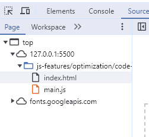
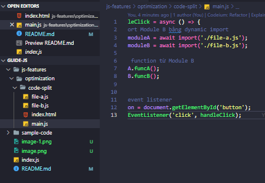
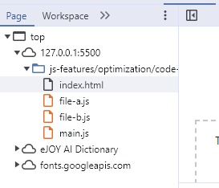

# JS Features

## Optimization

### Code Split

- -Khái niệm: là một trong những kỹ thuật giúp tăng tốc thời gian load javascript.

-Một trang web thường có một số thành phần cơ bản sau: HTML, CSS, Javascript và một số media như images, fonts … Và có thể Javascript là một trong những thành phần làm chậm thời gian load page nhất. Một byte của Javascript cần nhiều thời gian xử lý hơn so với 1 byte của css hay images. Đa số SPA hiện nay đều cần một bundler như webpack. Công việc của webpack là build, minified, và tạo nên những file bundle như js, css, html. Khi mà trang web có hàng trăm file js, nhiệm vụ của webpack là gom gọn và tối ưu những file đó thành một vài file nhỏ hơn. Một khi mà trang trở nên lớn hơn, nhiều tính năng hơn thì kích thước nhưng file bundle js trở nên lớn hơn.
=>code-splitting có nghĩa là chúng ta chia nhỏ code hiệu quả hơn và load những phần cần thiết cho trang web. Chúng ta sẽ chia nhỏ code ra 10 file bundle.js và load từng file theo yêu cầu của user (Trong reactJS kỹ thuật này cũng được hiểu như là lazy load javascript hay chính là dùng lazy-loading và suspense).

- Ví dụ:   
  - bên trên chúng ta chia nhỏ file ra và chỉ cho load khi người dùng click (áp dụng kĩ thuật lazy load). Chúng ta có thể thấy ta đã chia ra thành 3 file bundle js và chỉ tải khi cần

### Lazy load

**Lưu ý:** Về mặt lý thuyết, tất cả các resource liên quan tới interaction của user (Scroll, click, hover, press,…) đều có thể lazy load được.

# Interview

- [https://github.com/Ren0503/fullstack-interviews/tree/main/frontend/javascript](https://github.com/Ren0503/fullstack-interviews/tree/main/frontend/javascript)

# Documents

- [https://madza.hashnode.dev/21-github-repositories-to-become-a-javascript-master](https://madza.hashnode.dev/21-github-repositories-to-become-a-javascript-master)

- [https://github.com/leonardomso/33-js-concepts](https://github.com/leonardomso/33-js-concepts)

- [https://github.com/yeungon/In-JavaScript-we-trust](https://github.com/yeungon/In-JavaScript-we-trust)

- [https://github.com/trieunt95-dev/js-nangcao/tree/master](https://github.com/trieunt95-dev/js-nangcao/tree/master)

- [https://github.com/jumaschion/You-Dont-Know-JS-1](https://github.com/jumaschion/You-Dont-Know-JS-1)

# Projects

- [https://github.com/bradtraversy/50projects50days](https://github.com/bradtraversy/50projects50days)

- [https://github.com/john-smilga/javascript-basic-projects](https://github.com/john-smilga/javascript-basic-projects)

# Tutorials

# Sample code
